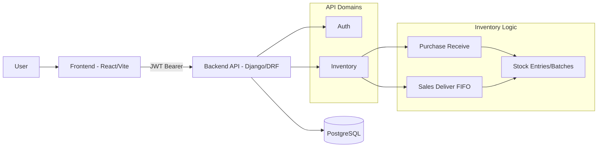

# Kaizntree - Inventory Management System

Inventory management platform for Food & Beverage CPG operations, built with a React frontend and Django REST API backend.

## 1) Project Overview

This repository contains:

- `client/`: React + TypeScript SPA (Vite, Mantine, React Query)
- `server/`: Django + Django REST Framework API (JWT auth, PostgreSQL/SQLite)
- `infrastructure/`: Terraform for AWS deployment (Elastic Beanstalk + RDS + S3/CloudFront)

Core capabilities implemented:

- Product and supplier/customer management
- Purchase orders and sales orders
- Stock control with batch entries
- Delivery/receiving flows that update stock automatically
- Financial snapshots per order (`total_amount`)
- Per-user data isolation with authenticated API access

## 2) Architecture & Technical Decisions

### Backend (Django + DRF)

- **REST-first API** with DRF `ModelViewSet` for consistent CRUD behavior.
- **JWT authentication** via `djangorestframework-simplejwt`.
- **Multi-tenant isolation at app level**: every core entity is linked to `user`, and querysets are filtered by authenticated user.
- **Transactional stock operations**:
  - Purchase receiving creates `Stock` entries and increments `quantity_received`.
  - Sales delivery consumes stock using **FIFO strategy** (earliest expiration first, then creation order).
  - Critical flows use `transaction.atomic()` + `select_for_update()` to avoid race conditions.
- **Order number generation** with per-user, per-month sequence counters (`PO-YYMM-XXXX`, `SO-YYMM-XXXXXX`).

### Frontend (React + TypeScript)

- **Feature-based organization** (`src/features/...`) to keep each domain isolated.
- **React Query** for server-state caching, loading/error handling, and mutation workflows.
- **Centralized API client** in shared layer (`src/shared/api`) to standardize request/auth behavior.

### Infrastructure (Terraform)

- **Cost-conscious AWS setup** designed for challenge/demo usage:
  - Elastic Beanstalk for backend hosting
  - RDS PostgreSQL for persistent data
  - S3 + CloudFront for frontend static hosting
- Infrastructure resources are versioned as code in `infrastructure/`.

## 3) High-Level Diagram



## 4) Local Setup

### Prerequisites

- Python 3.11+
- Node.js 20+
- PostgreSQL (optional for local; SQLite also supported)

### Backend

```bash
cd server
python -m venv .venv
# Windows PowerShell:
.\.venv\Scripts\Activate.ps1
pip install -r requirements.txt
```

Create `server/.env` (minimum):

```env
SECRET_KEY=replace-me
DEBUG=True
# Optional PostgreSQL
# DB_HOST=127.0.0.1
# DB_NAME=kaizntree
# DB_USER=postgres
# DB_PASSWORD=postgres
# DB_PORT=5432
```

Run backend:

```bash
python manage.py migrate
python manage.py runserver
```

### Frontend

```bash
cd client
npm install
npm run dev
```

Default local URLs:

- Frontend: `http://localhost:5173`
- Backend: `http://127.0.0.1:8000`

### Tests (Backend)

```bash
cd server
pytest
```

## 5) API Documentation

A complete endpoint reference is available at:

- `docs/API_ENDPOINTS.md`

Summary:

- Base API URL: `/api`
- Auth routes: `/api/auth/...`
- Inventory routes: `/api/inventory/...`
- Auth method: `Authorization: Bearer <access_token>`

## 6) Key Business Rules

- Users only access their own entities (products, orders, stock, suppliers, customers, etc.).
- Stock decreases only through delivery flows and follows FIFO by expiration date.
- Receiving purchase orders creates stock batches (`source = PO`).
- Order statuses can be advanced through dedicated actions and/or partial updates.

## 7) Deployment Notes

- Frontend and backend deployment scripts are in `client/scripts/`.
- Terraform definitions and outputs are in `infrastructure/`.
- This stack is tuned for **challenge/demo** cost-efficiency and should be hardened for production use (restricted hosts, CORS tightening, secrets management, backups/HA, monitoring).
